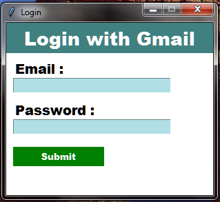
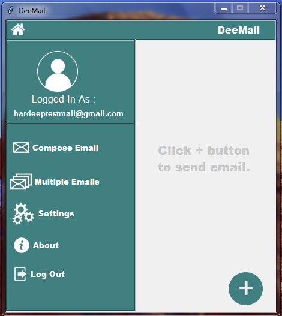
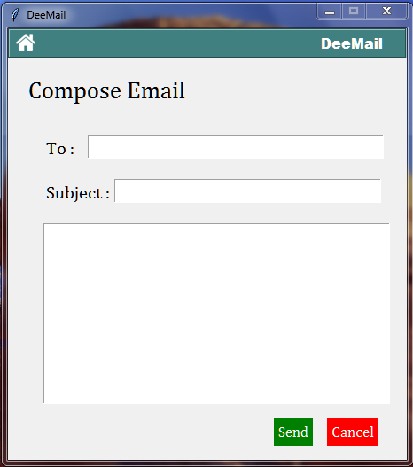
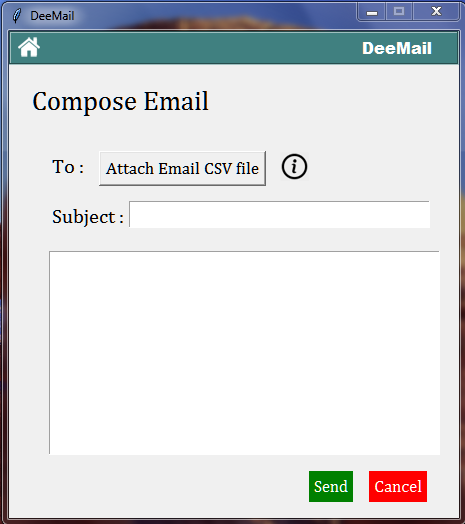

# DeeMail

# Summary
This application can send mails from gmail account to any one. this can also send multiple emails at a time. Through this you have to login to your gmail account. You can any logout any time.

# Features
1. Send emails

2. Send multiple emails in one click.

3. Login Through Gmail account.

4. Good GUI

## Requirements
1. Python3.6 or above
2. smtplib module
3. Turn on less secure apps on https://myaccount.google.com/lesssecureapps This is 100% safe.

## How to Run
Just open the main.py file.

## Screenshots

